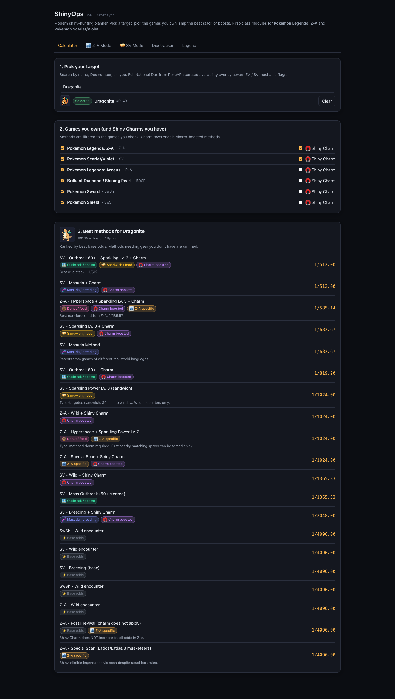

# ShinyOps

Live: **https://pokemon-shiny-guide.vercel.app**

Shiny hunting is a planning problem before it's a luck problem. ShinyOps is a clean, mobile-friendly planner that helps you pick the highest-odds method for any species across the games you actually own. First-class deep planners for **Pokemon Legends: Z-A** and **Pokemon Scarlet/Violet**.



## What it does

- **Calculator.** Pick a target, check the games you own, see every viable hunt method ranked by best base odds. Dimmed rows for charm-only methods you can't run yet, locked warnings on shiny-locked species.
- **Z-A Mode.** Encounter mode + Shiny Charm + Sparkling level + donut type. Surfaces the fossil charm exception, the Lv. 3 forced-shiny rule, the special-scan exceptions (Latios/Latias/three musketeers), and the static-lock warning.
- **SV Mode.** Encounter mode + Charm + Sparkling Power Lv. 3 sandwich + outbreak count + Masuda. Type-targeted recipe card sourced from Game8, plus the best 8-roll stack tip and the Let's Go mode tip.
- **Dex Tracker.** Per-species `Needed | Hunting | Caught | Locked` board. Filter by status, persist locally.
- **Legend.** Chip glossary so the UI explains itself.

Five games covered today: Z-A, Scarlet/Violet, Legends: Arceus, BDSP, Sword/Shield. Roughly 977 species carry baseline catchability data; ~30 carry curated overlay flags for locks, fossils, and scan exceptions.

## Why this exists

The original "Comprehensive Shiny Hunting Guide" worked but was a 1000-row Bootstrap form that put the planning burden on the player. Fine in 2017. Less fine now that the games stack five different boost mechanics that interact in non-obvious ways:

- which boost actually applies to your species
- which boosts are mutually exclusive
- which targets are locked regardless of method
- which charms add which roll counts in which game

ShinyOps replaces the form with a focused planner. Search-first target picker, all toggles on one panel, every method shows `rolls / 4096 -> 1/N` so the math is visible.

## Run it locally

```bash
npm install
npm run dev                              # vite dev server
npm test                                 # vitest run
npm run build                            # tsc check + vite build
npm run sync:pokemon                     # full National Dex (cached after first run)
npm run sync:pokemon -- --limit 30       # dev-friendly subset
```

The dex sync writes two generated files under `src/data/generated/`:

- `pokemon.ts` - 1200ish rows of names, dex numbers, types, sprite URLs (from PokeAPI `/pokemon`)
- `availability.ts` - speciesId → game-id list (from PokeAPI `/pokedex` resources)

Re-runs hit the disk cache under `.cache/pokeapi/` so they're cheap.

## How the data works

Two layers, hand-curated overlay always wins:

1. **Generated baseline.** `npm run sync:pokemon` fetches PokeAPI for species metadata + regional pokedex membership. Every species in `lumiose-city` or `hyperspace` pokedex gets `za: catchable`, every species in `paldea/kitakami/blueberry` gets `sv: catchable`, etc. See `scripts/sync-pokemon.mjs` for the game→pokedex mapping.
2. **Curated overlay.** `src/data/species.ts` carries the *exception* facts: starter locks, fossil flags, scan exceptions, mythical lock notes. Each curated entry overrides the baseline per-game so e.g. Charmander gets `sw + sv` from baseline AND `za: locked` from the overlay.

Mechanic data (rolls per condition, recipe primary ingredients, ZA fossil-charm exclusion, scan exceptions, lock rules) stays hand-curated. Every method/recipe carries a source URL.

### Sources

Z-A:
- RotomLabs Z-A shiny rates (citing the Anubis/Sibuna datamine)
- Serebii Z-A shiny page
- IGN Pokemon Legends: Z-A wiki

Scarlet/Violet:
- Serebii SV shiny page
- IGN SV wiki (cites Anubis/Sibuna datamine)
- Game8 SV Sparkling Power Lv. 3 fewest-ingredient recipe table

PokeAPI for bulk dex metadata. Pokemon Showdown / PokemonDB for sprite CDN URLs.

### Odds model

Source of truth is **rolls**, not pre-computed odds. Display formula is `1 / (4096 / rolls)`, rounded to two decimals. This matches what the SPEC says and lines up with most community references within rounding error.

Some references (RotomLabs, IGN) publish slightly different denominators because they use the at-least-one model `1 / (1 - (1 - 1/4096)^rolls)`. Difference is under 0.5% (4 rolls = 1/1024.00 here vs 1/1024.38 in the probability model). Method ranking is identical either way, which is the only thing the UI uses the math for.

Tested with table-driven cases for `rolls 1..8`, full ZA computation across all five modes including the fossil charm exception and static lock, full SV computation including the best 8-roll stack, and `compareOdds` ordering. `npm test` runs 70 cases in under a second.

### Sprite provider chain

`<Sprite>` builds an ordered candidate URL list and falls through on `onError`. For shiny variants:

1. local override (URL only, never a checked-in image)
2. Pokemon Showdown animated shiny GIF
3. PokeAPI shiny PNG (from the generated dex)
4. PokemonDB HOME shiny PNG
5. Serebii (opt-in only - coverage is uneven across gens)
6. PokeAPI official-artwork shiny, then non-shiny artwork, then `front_default`
7. initial-letter avatar

Slug normalization (lowercase, ascii-fold, strip apostrophes/periods/colons, regional suffix renames) lives in `src/lib/sprite-naming.ts` and is unit-tested.

Edge-case forms get typed entries in `src/data/sprite-overrides.ts` instead of regex creep in the chain.

## Caveats

- Odds come from community datamines; first-party numbers are not published. Treat them as best-known.
- The Z-A fossil charm-exclusion is the consensus reading from the datamine, not first-party confirmed.
- Sparkling Power Lv. 3 forced-first-shiny (Z-A) is asserted by datamine and not officially confirmed.
- Recipes are the simplest known route per type. Many other Lv. 3 paths exist.
- Locked-species lists reflect launch-window community testing.
- BDSP coverage gap: PokeAPI's `extended-sinnoh` is the Platinum regional dex, so BDSP's Grand Underground / Ramanas Park additions (e.g. Dragonite in BDSP) aren't in the baseline. Curated overlay can fill these as needed.

## Source policy and attribution

**Mechanic data** is hand-curated text, sourced from RotomLabs, IGN, Serebii, Game8, Bulbapedia. Each method/recipe record carries a source URL.

**Bulk dex data** comes from PokeAPI (pokeapi.co), a free open GET API. The sync script caches every fetch and defaults to concurrency 4 to stay polite.

**Sprite imagery is not vendored.** The repo stores URLs only; the browser fetches images at render time. PokeAPI sprite URLs reference imagery owned by Nintendo, The Pokemon Company, and Game Freak. Availability through these CDNs is not a license to redistribute. No sprite assets are checked in.

This setup is fine for personal / educational / portfolio use. A commercial release would need to replace or license the imagery.

## License

MIT for code (see [LICENSE](LICENSE)). Pokemon names, sprites, and trademarks are property of Nintendo / The Pokemon Company / Game Freak. ShinyOps is an unaffiliated fan tool.
